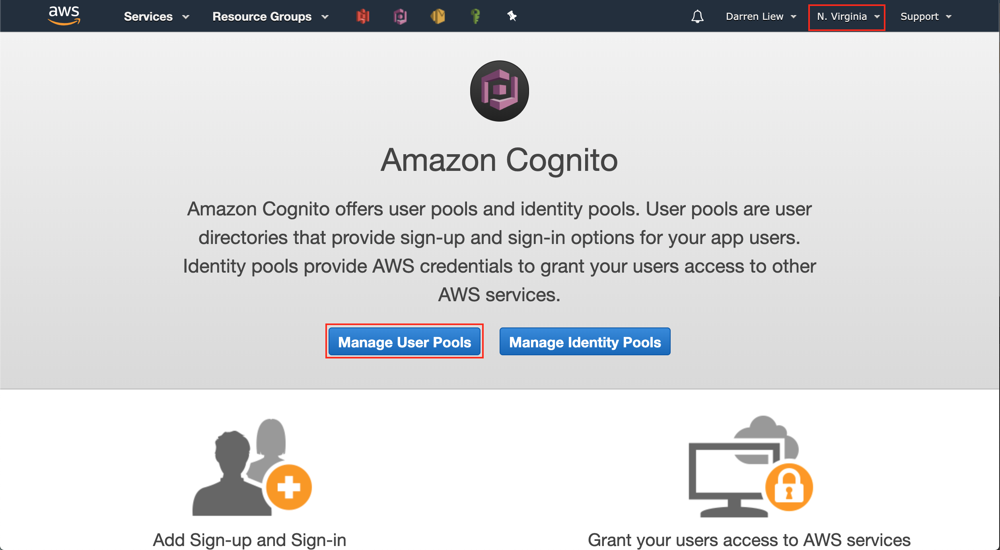
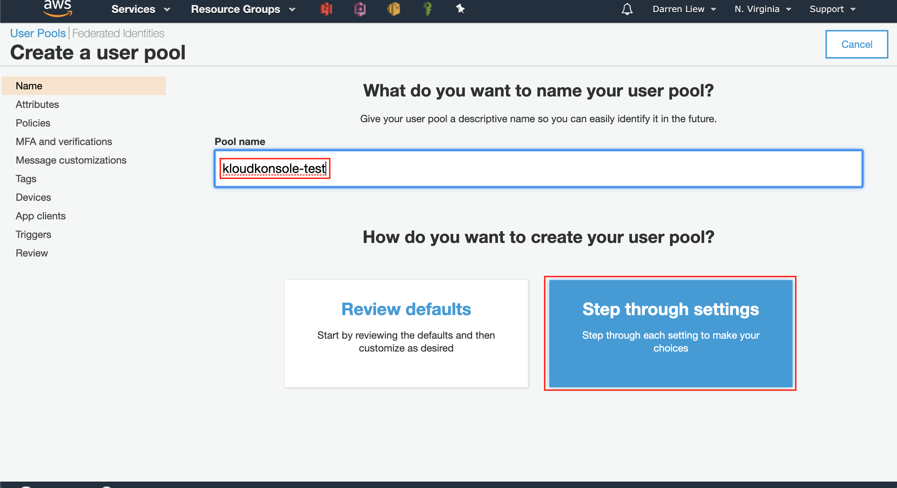
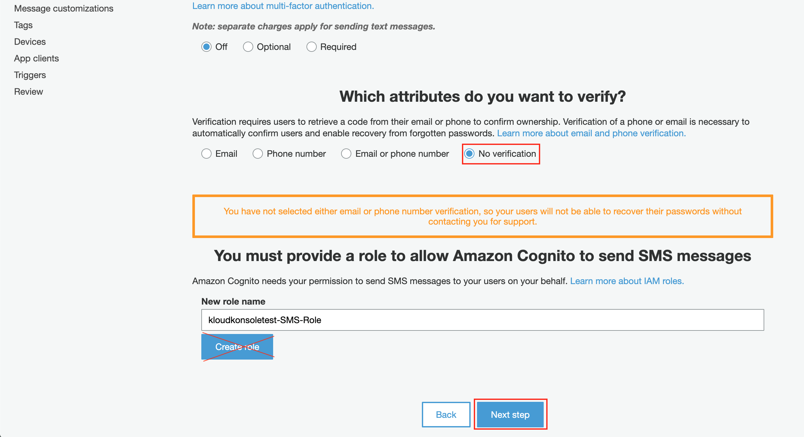
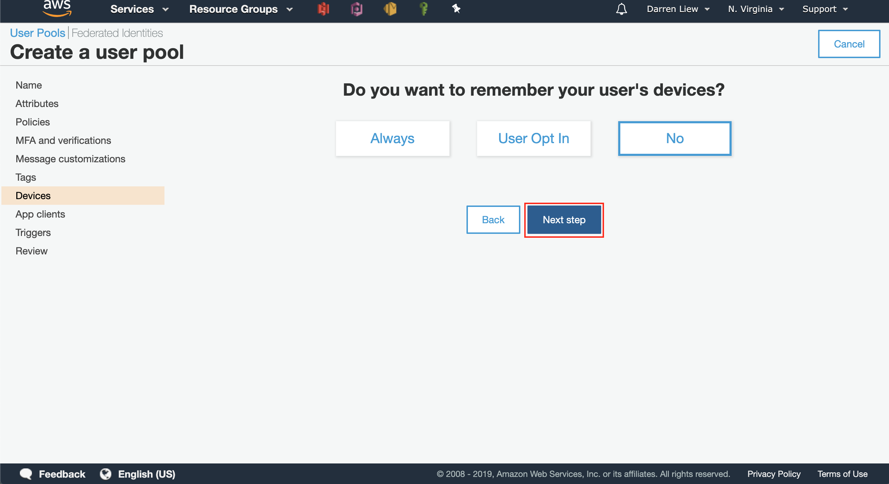

# Setup Cognito
You will need cognito to manage your user identity and access to your mailbox

### prerequisite:
- about 30 mins time

## Create User Pool
* [Signin to AWS console](https://console.aws.amazon.com/?nc2=h_m_mc) if you haven't done so

* Pick `Services` > `Cognito`

* Pick `Manage User Pools`, in next section we will deal with the identity pools

* First click on `Create a user pool` button

* Give a name to user pool, choose `Step throug settings`

* Setup the attributes you going to collect from your users. for this example we only asked for `email`

* This page ask for the security settings of the password, for this example we uncheck `Required special characters` to keep the signup process simple

* In MFA nd verification page, feel free to add multi-factor authetication (MFA) to increase security of the credential. again since this for tester use only we keep it simple. if sms verification is not required, the SMS role creation can be ignored

* In Message page, in `Do you want to customize your email address?` key in the email address you created in [Setup SES](../doc/setup-ses.md).
click `Yes` in `Do you want o send emails through your Amazon SES configuration?`
then clikc `Next Step` to proceed

* Skip the `Add Tags` page

* In devices page, choose `NO` to the `Do you want to remember your user's devices`. The settings will limit number of devices your user can login at the same time. for this exmaple, we ignored them

* In `App Client` page, click the `Add an app client` link

* Key in your client app name and also uncheck the `Generate client secret` (we will use client side aws sdk to access S3, hence we do not need this)

* Skip the `Triggers` page

* In `Review` page, after reviewing the settings click on `Create pool` button to create your user pool

