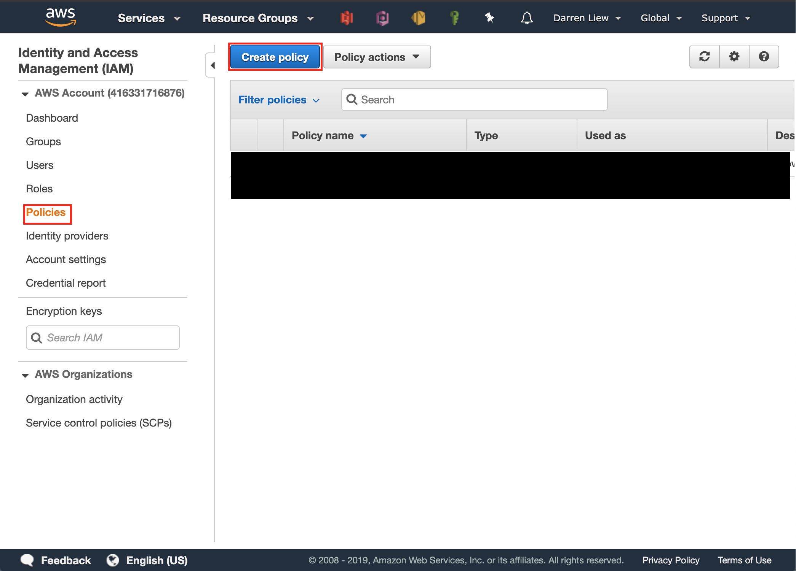
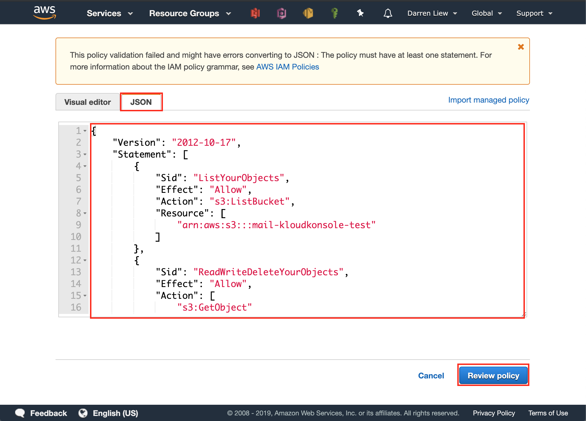
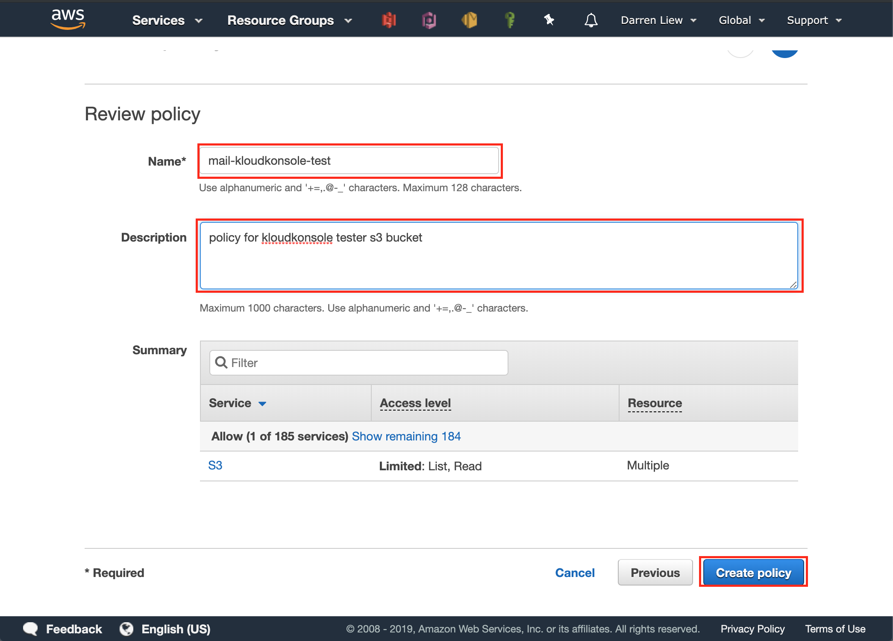

# Setup IAM
From cognito setup there are two IAM roles created for you, in this section we will setup the two IAM roles

### prerequisite:
- a S3 bucket name, `mail-kloudkonsole-test` for this example
- a cognito application name, `kloudkonsole` for this exmaple
- about 30 mins time

## Create Policy
* go to IAM page


* click on `Roles` in side menu and your role in the list, for this example it is called `Cognito_kloudkonsole_testerAuth_Role`


* click on `Attach Policy` button


* click on `Create Policy` button


* click on `Create Policy` button


* Open the `json` tab and paste the following json to the text area


This policy is to allow regsitered users to list and read the content in the specified S3 bucket (`mail-kloudkonsole-test`)

**remember to replace `mail-kloudkonsole-test` by your s3 bucket name**
```json
{
	"Version": "2012-10-17",
	"Statement": [
		{
			"Sid": "ListYourObjects",
			"Effect": "Allow",
			"Action": "s3:ListBucket",
			"Resource": [
				"arn:aws:s3:::mail-kloudkonsole-test"
			]
		},
		{
			"Sid": "ReadWriteDeleteYourObjects",
			"Effect": "Allow",
			"Action": [
				"s3:GetObject"
			],
			"Resource": [
				"arn:aws:s3:::mail-kloudkonsole-test/*"
			]
		}
	]
}
```

* finally give your new policy a name and click on `Create policy` button

