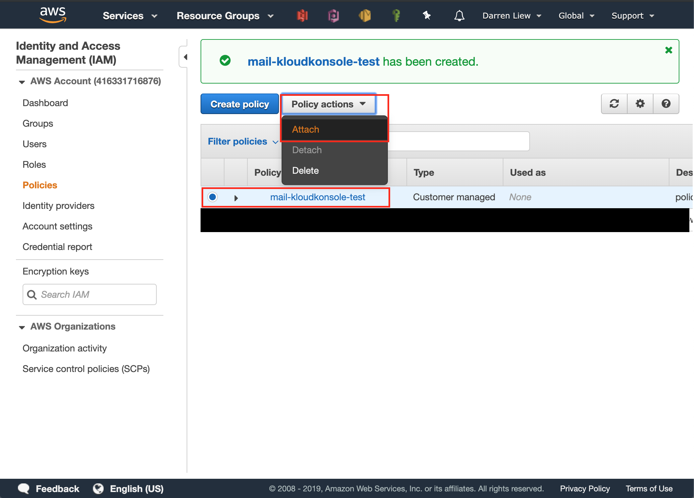

# Setup IAM
From cognito setup there are two IAM roles created for you, in this section we will setup the two IAM roles

### prerequisite
- IAM role that used by cognito service, see [setup-cognito](doc/setup-cognito.md)
- a S3 bucket name, `mail-kloudkonsole-test` for this example
- about 30 mins time

## Attach a IAM Policy to your Cognito Role
* go to IAM page


* select `Policies` at the sidebar and click on `Create Policy` button


* When the create policy dialogbox open, click on `JSON` tab and then copy the following policy to the textarea


This policy is to allow regsitered users to list and read the content in the specified S3 bucket (`mail-kloudkonsole-test`)

**remember to replace `mail-kloudkonsole-test` by your s3 bucket name**
```json
{
	"Version": "2012-10-17",
	"Statement": [
		{
			"Sid": "ListYourObjects",
			"Effect": "Allow",
			"Action": "s3:ListBucket",
			"Resource": [
				"arn:aws:s3:::mail-kloudkonsole-test"
			]
		},
		{
			"Sid": "ReadWriteDeleteYourObjects",
			"Effect": "Allow",
			"Action": [
				"s3:GetObject"
			],
			"Resource": [
				"arn:aws:s3:::mail-kloudkonsole-test/*"
			]
		}
	]
}
```

* give your new policy a name and click on `Create policy` button to create your policy


* go back to policies list and select new policy and then choose `Attach` as policy actions


* In `Attach Policy` list, select the role created by cognito, e,g, `Cognito_kloudkonsole_testerAuth_Role` then click `Create Policy`


by doing this you allow loginned users about to do readonly actions on your S3 bucket.
