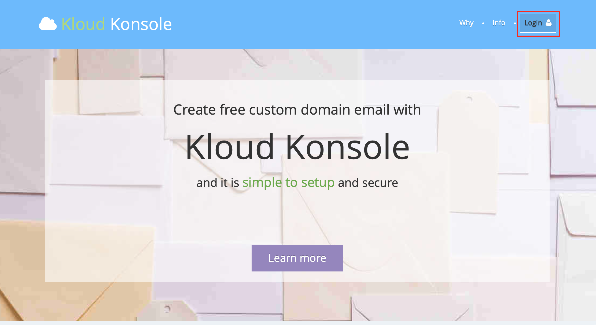
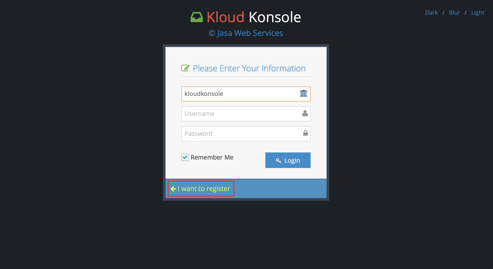
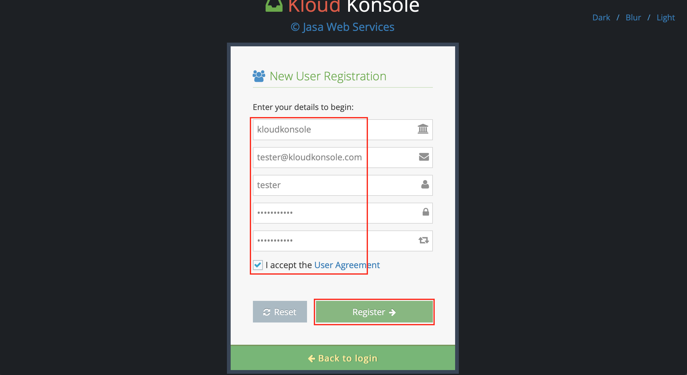
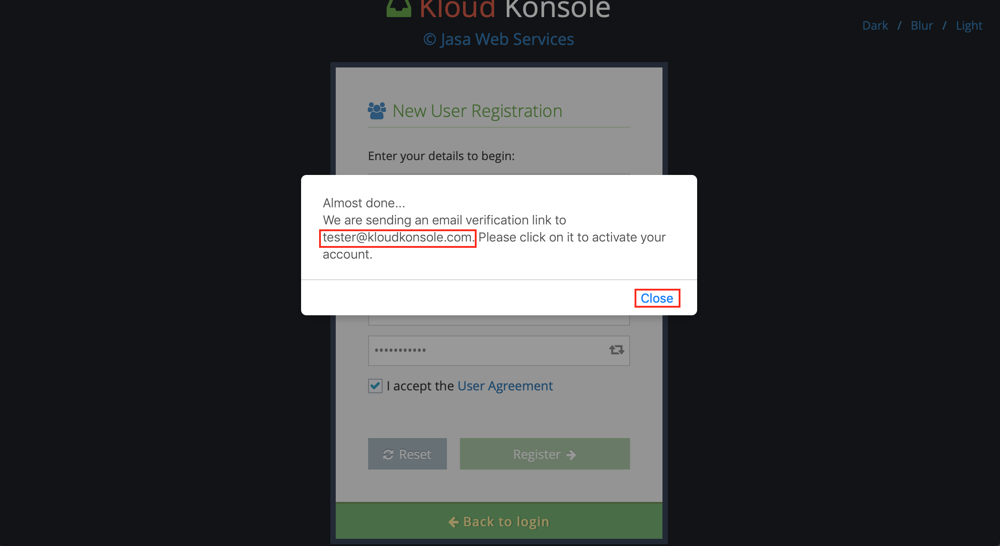
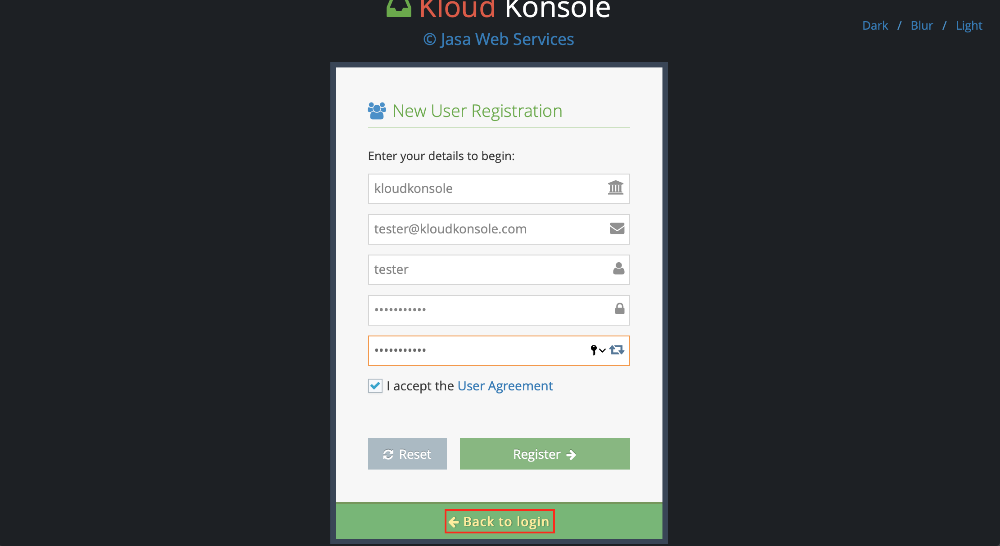
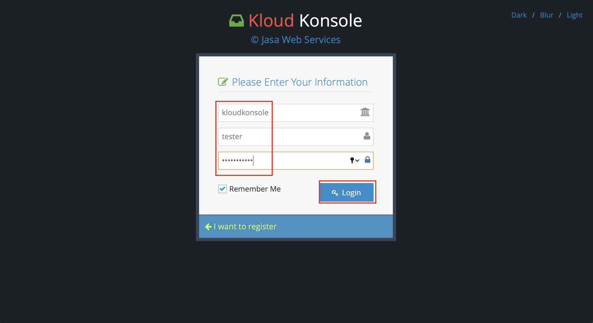
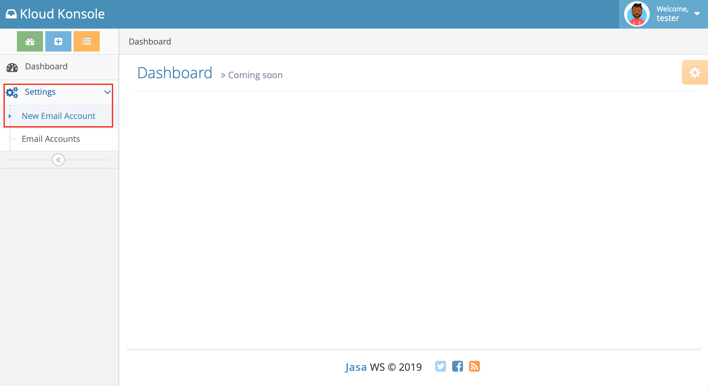
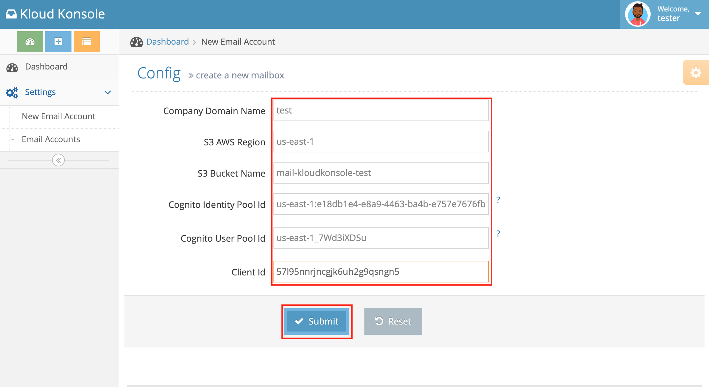
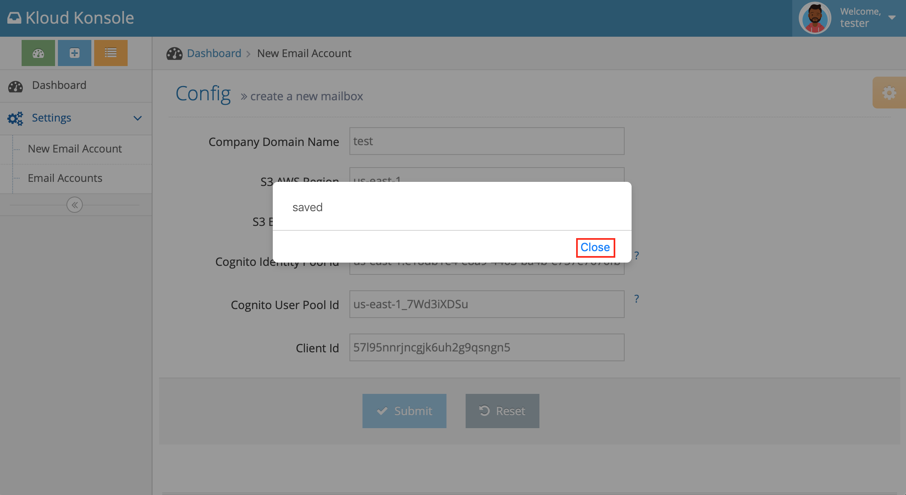

# Setup Kloud Konsole

### Prerequisite
- S3 region name
- S3 bucket name
- Cognito user pool id
- Cognito app client id
- Cognito identity pool id
- about 5 mins time

## Signup a kloudkonsole account
This step is only needed for each S3 bucket you want to read by Kloud Konsole's email webclient.

** Please note that this procedure only tell kloudkonsole where is your s3 bucket and which user pool is managing it, this does not give kloud konsole to read and modify the S3 bucket **

* type `https://kloudkonsole.com` in your browser address bar, click on `Login` link at top right corner

* Click `I want to register` link

* at registration page make sure the company name is `kloudkonsole` fill up the form and click `Register`
> to prevent spamming, kloudkonsole required a valid email address to register.

* if successful, you should received the instruction to verify your email address

* go to your mail client and click on the email verification link, this will confirm your account

* go back kloudkonsole page and click on `Back to login` link

* login with the same credential

* click on `Settings` link, click on `New Email ccount`

* key in your AWS resources id(s).

* congratulation! you have registered a free account with Kloud Konsole

