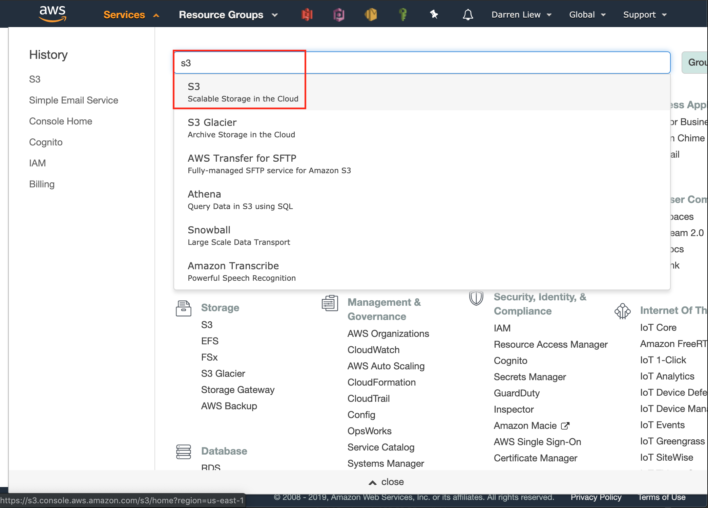
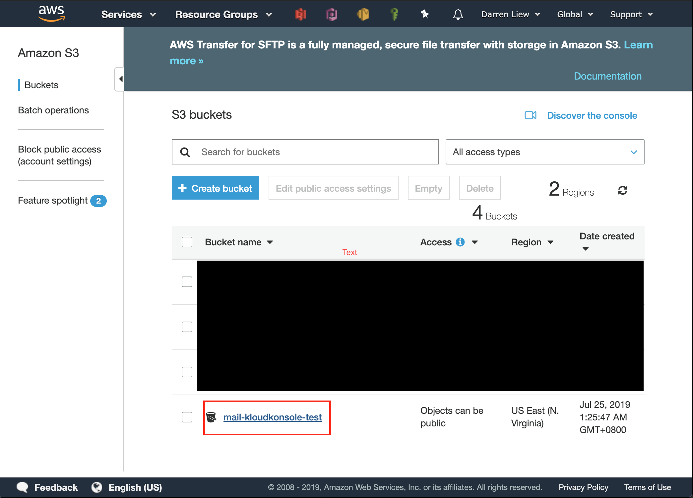
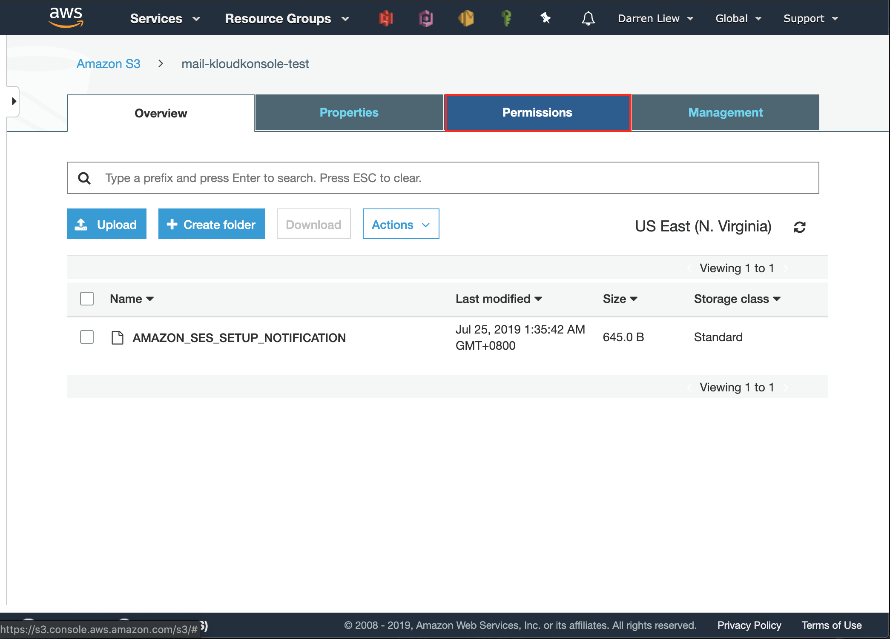
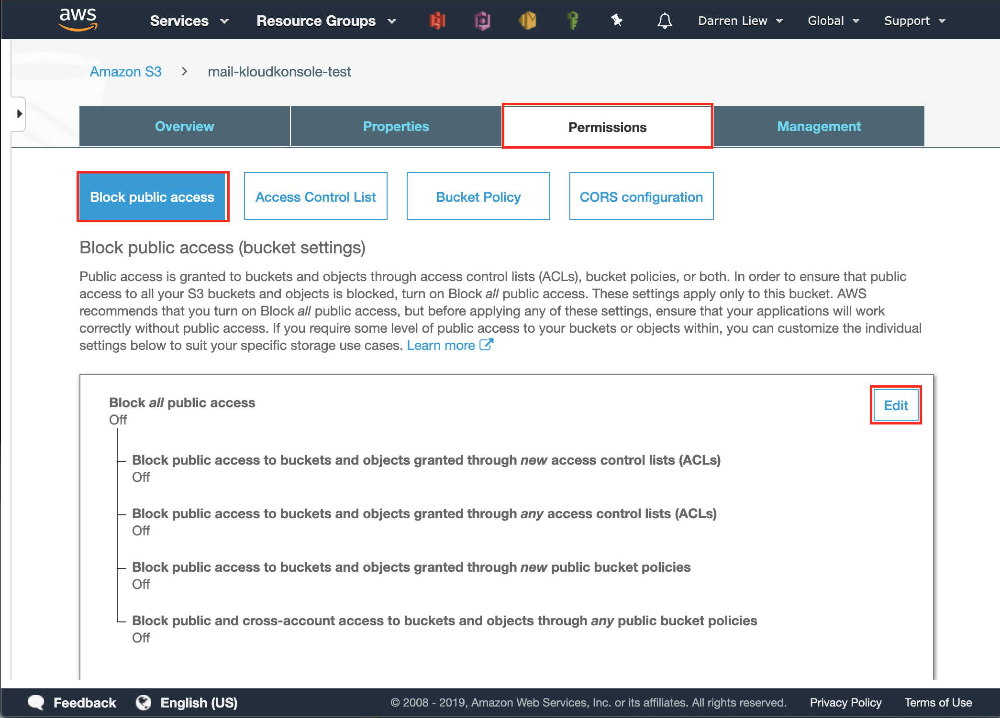
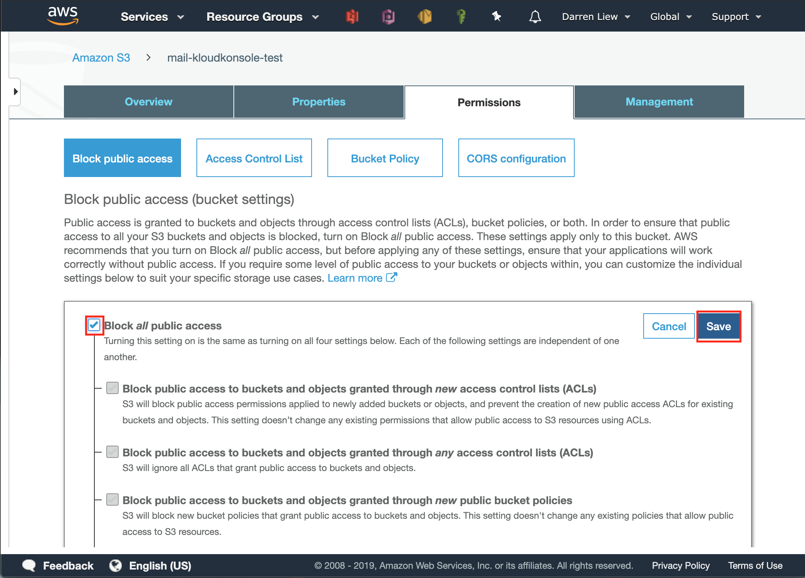
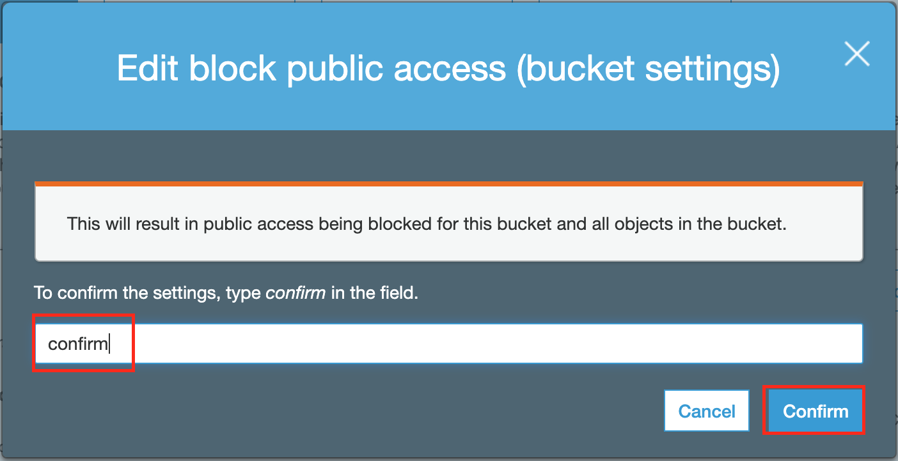
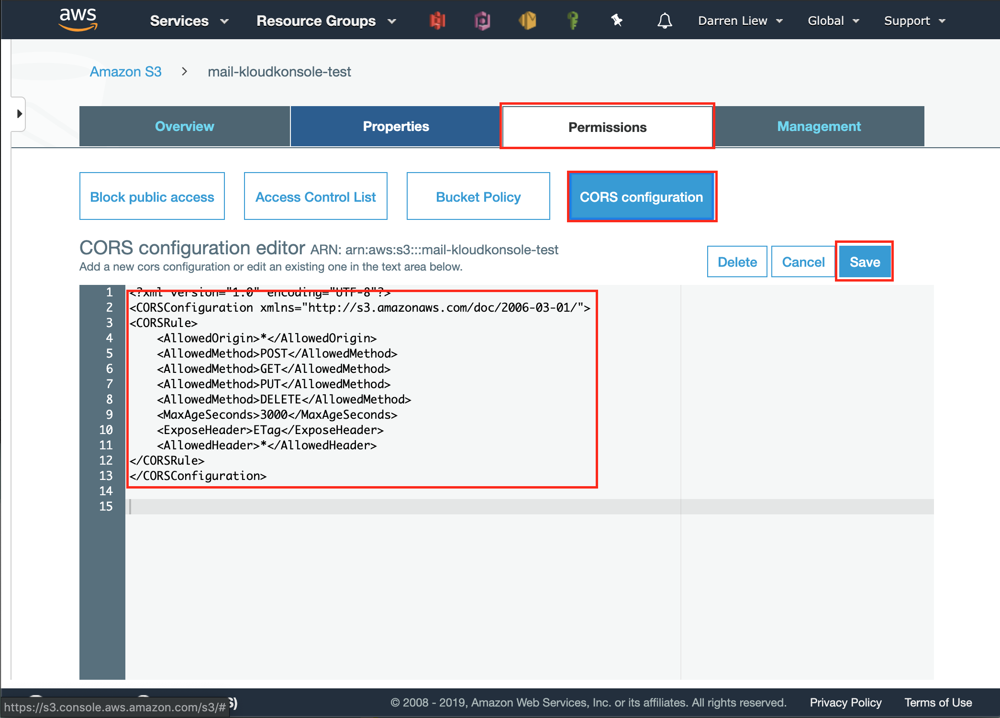
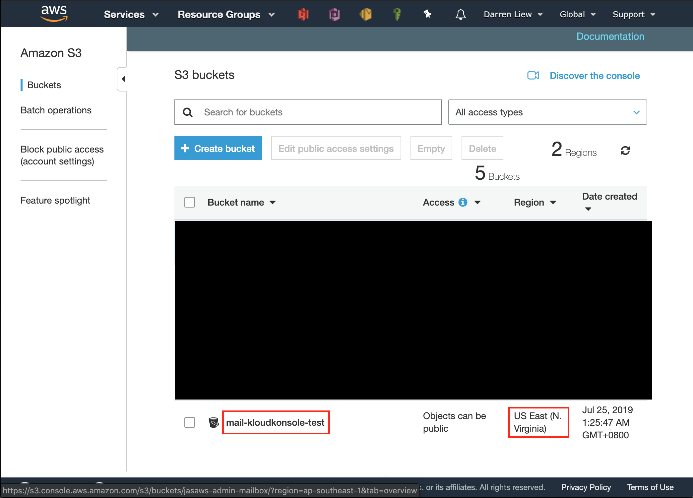
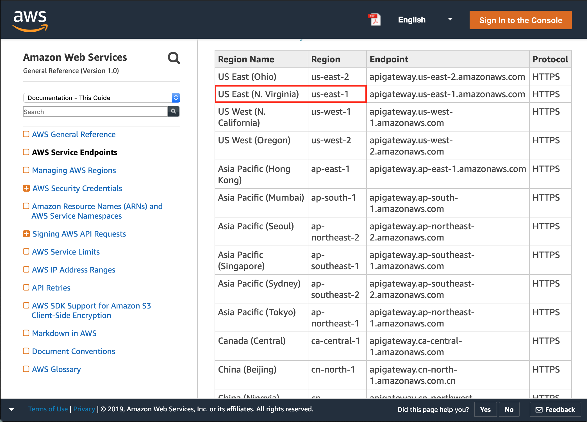

# Setup S3
S3 bucket by dafault does not allow communicate with third party app such as Kloud Konsole directly, this section we will discuss how to enable that

### Prerequisite
- A bucket setup in SES to receive mails, in this example it is called `mail-kloudkonsole-test`
- 30 mins time

## Set S3 Permission
* use AWS `services` shortcut to go S3 page


* Click on `mail-kloudkonsole-test` bucket


* Click on `Permission` tab


* Click on `Block public access` and `edit`


* Check `Block all public access` and click `Save` button. this can reduce the chances of accidentally share your bucket to the public


* In the conrim dialogbox, type `confirm` and click `Confirm` button


* While still in `Permissions` tab, click `CORS configuration` button. 


* Paste the followCORSConfiguration to the textarea and click `Save` button


this is to enable regstered third party app to access this bucket
```xml
<?xml version="1.0" encoding="UTF-8"?>
<CORSConfiguration xmlns="http://s3.amazonaws.com/doc/2006-03-01/">
<CORSRule>
    <AllowedOrigin>*</AllowedOrigin>
    <AllowedMethod>POST</AllowedMethod>
    <AllowedMethod>GET</AllowedMethod>
    <AllowedMethod>PUT</AllowedMethod>
    <AllowedMethod>DELETE</AllowedMethod>
    <MaxAgeSeconds>3000</MaxAgeSeconds>
    <ExposeHeader>ETag</ExposeHeader>
    <AllowedHeader>*</AllowedHeader>
</CORSRule>
</CORSConfiguration>
```

## Take Away
Please take note of the S3 bucket name and region it reside, we need these info when configure Kloud Konsole


the region name `US East (N. Virginia)` can not be used directly, we need to get the region id from [here](https://docs.aws.amazon.com/general/latest/gr/rande.html)


for this example 
- bucket name: `mail-kloudkonsole-test
- region: `us-east-1`
