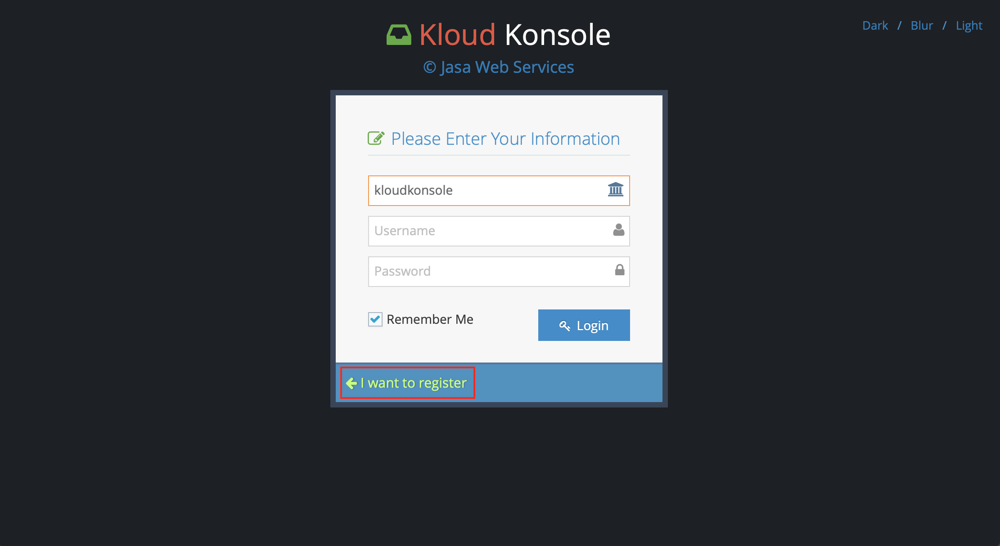

# Setup Webmail

### Prerequisite
- a company domain name that setup previously in [Setup KloudKonsole](doc/setup-kloudkonsole.md). for this example, it is called `test`

## Signup your users
this procedure is for your users who like to view mail from the S3 bucket

* type `https://kloudkonsole.com` in your browser address bar, click on `Login` link at top right corner

* Click `I want to register` link

* at registration page make sure the company name is `test` fill up the form and click `Register`

* if successful, you should received the instruction to verify your email address
> you should informed your account admin about your username

* this step is for account admin to verify user account. go to AWS cognito, user pool page

* click on `Users and groups` then look for the username. click on the username

* click on the `Confirm user` button to confirm the account

* make sure the `Account Status` changed to `Enabled/CONFIRM`. Informed your user the account has been confirmed and procceed to the login process

* ths step is for the registered user. go back kloudkonsole page and click on `Back to login` link

* login with the same credential

* when you are in kloud konsole, click on mailbox at the sidebar

* wait for awhile, it depends on how large is your S3 bucket, kloudkonsole will fetch the mail and show them in mailbox

