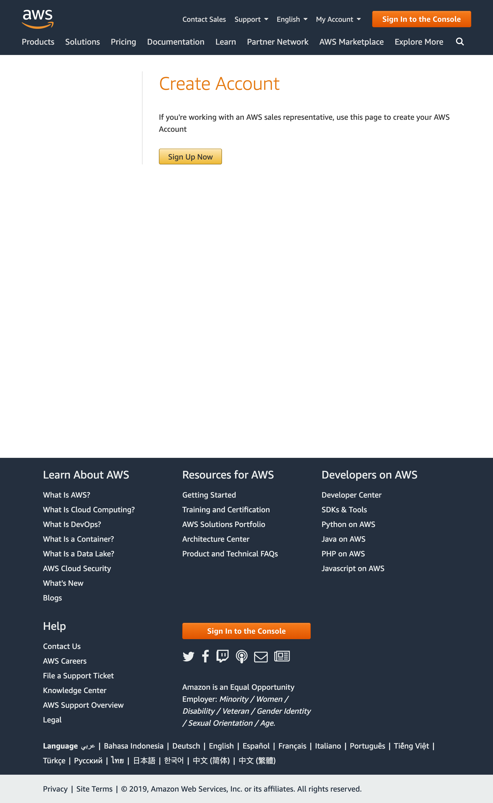

# Setup AWS
the prerequisite of this guide
- an email address
- a credit card or debt card, AWS account is free to create, you will only be charged when your usage ha exceeded the [generous free tier](https://aws.amazon.com/free/?all-free-tier.sort-by=item.additionalFields.SortRank&all-free-tier.sort-order=asc&awsf.Free%20Tier%20Types=categories%23alwaysfree)
- and, about 30 mins time

## Steps
* Go to [AWS create account page](https://aws.amazon.com/resources/create-account/) and click on `Sign Up Now` button.

* Key in the prepared email address, username, password and a account name, usually it is your organization name

