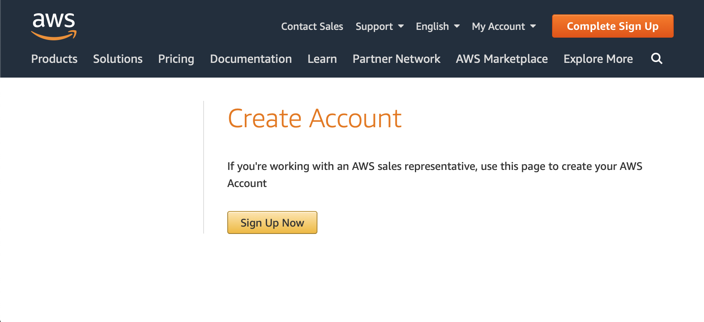
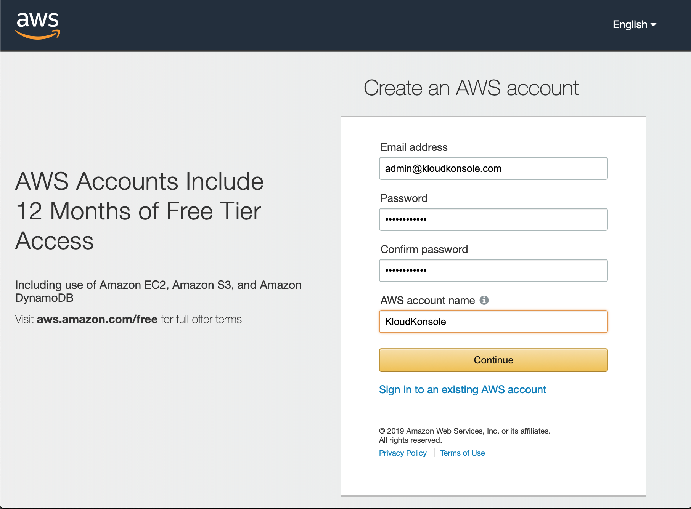
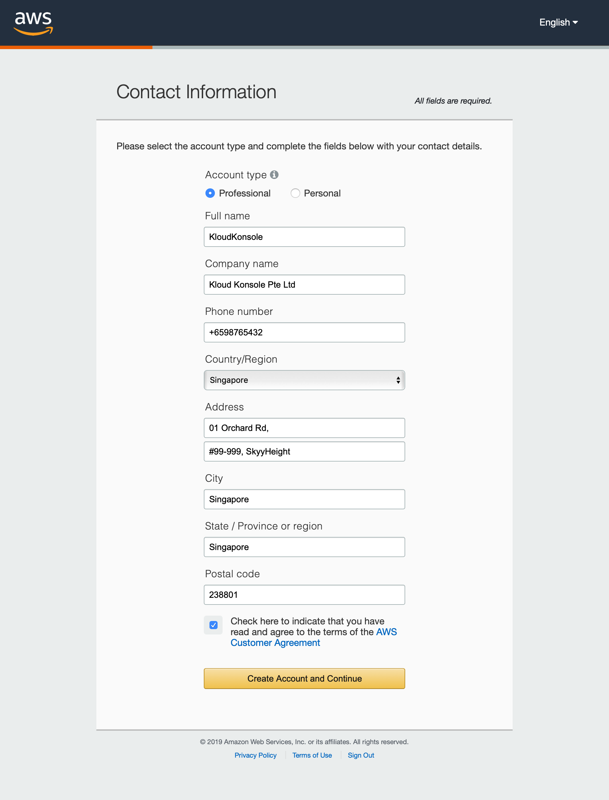
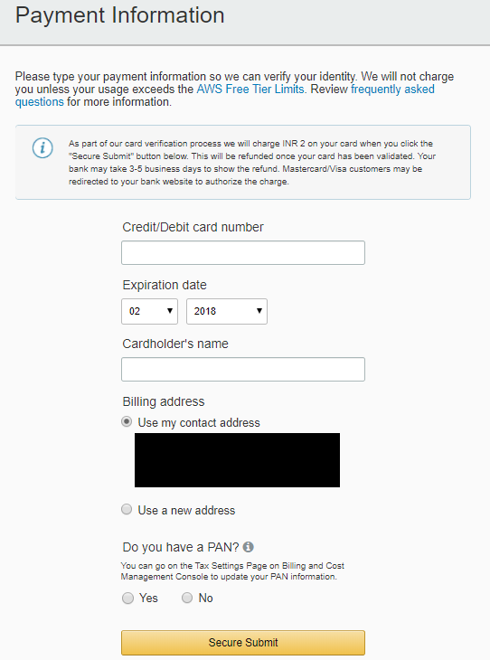
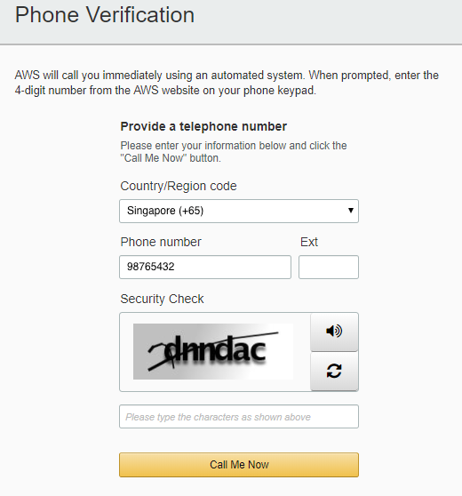
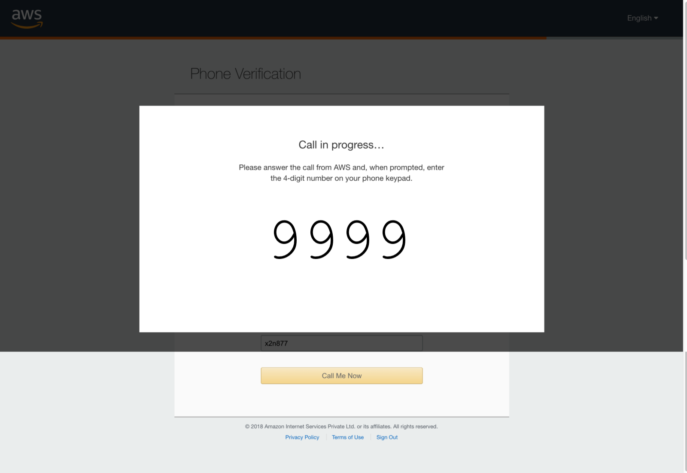
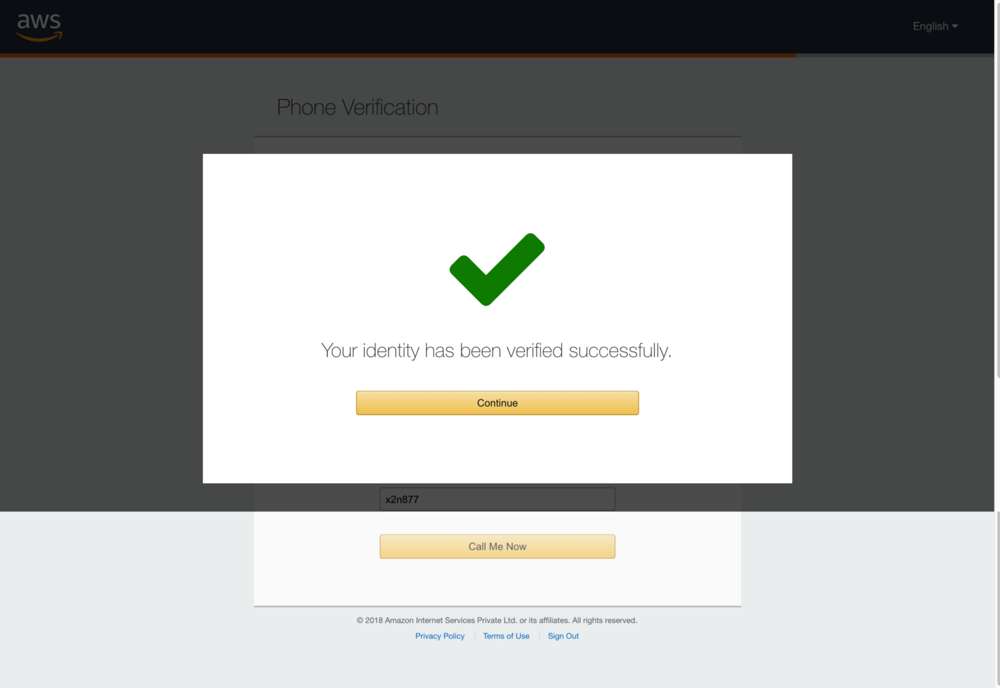
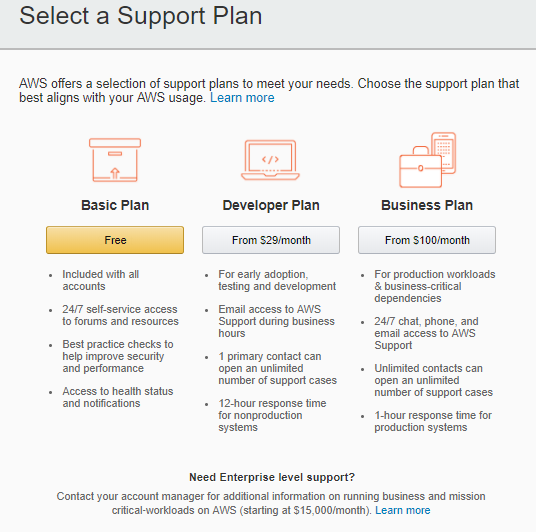

# Setup AWS
prerequisite:
- an email address
- a credit card or debt card, AWS account is free to create, you will only be charged when your usage has exceeded the [generous free tier](https://aws.amazon.com/free/?all-free-tier.sort-by=item.additionalFields.SortRank&all-free-tier.sort-order=asc&awsf.Free%20Tier%20Types=categories%23alwaysfree)
- and, about 20 mins time

## Create your account
* Go to [AWS create account page](https://aws.amazon.com/resources/create-account/) and click on `Sign Up Now` button.

* Key in the prepared email address, username, password and a account name, usually it is your organization name

* Choose type of account you going to create, **Professional** or **Personal**. in this example I choose Professional
> Personal accounts and professional accounts have the same features and functions

Enter the required Contact Information fields, read and understand the terms of the AWS Customer Agreement and then click on `Create Account and Continue`

You receive an email to confirm that your account is created. You can sign in to your new account using the email address and password you supplied. However, you can't use AWS services until you finish activating your account.

## Add a payment method

* On the Payment Information page, use a valid credit card fill in the required Payment Information fields and then click on `Secure Submit`
> If you have a different billing address for your AWS account, choose Use a new address before you choose `Secure Submit`.

## Verify your phone number

2. Choose your country or region code from the list.
3. Enter a phone number where you can be reached in the next few minutes.
>  If you wish to use a different country code and phone number you can change the entries.

4. Enter the code displayed in the captcha.
5. When you're ready, Choose whether you want to verify your account by `Call Me Now` or `Send OTP` (if available). In a few moments, an automated system will contact you.

6. Enter the PIN you receive by text message or voice call

7. After you have entered the code the browser will refresh again and a message displayed that your identity has been verified successfully. Click on `Continue`

## Choose an AWS Support plan

* Click on the `Free` option under Support Plans

After you choose a Support plan, a confirmation page indicates that your account is being activated. Accounts are usually activated within a few minutes, but the process might take up to 24 hours.

You can sign in to your AWS account during this time. The AWS home page might display a button that shows `Complete Sign Up` during this time, even if you've completed all the steps in the sign-up process.

When your account is fully activated, you'll receive a confirmation email. After you receive this email, you have full access to all AWS services.
