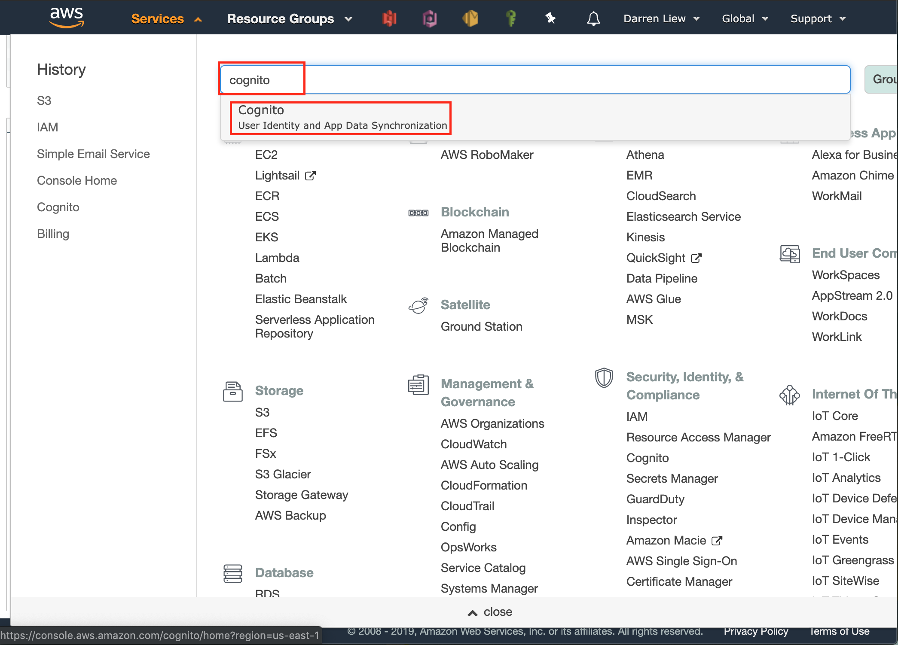
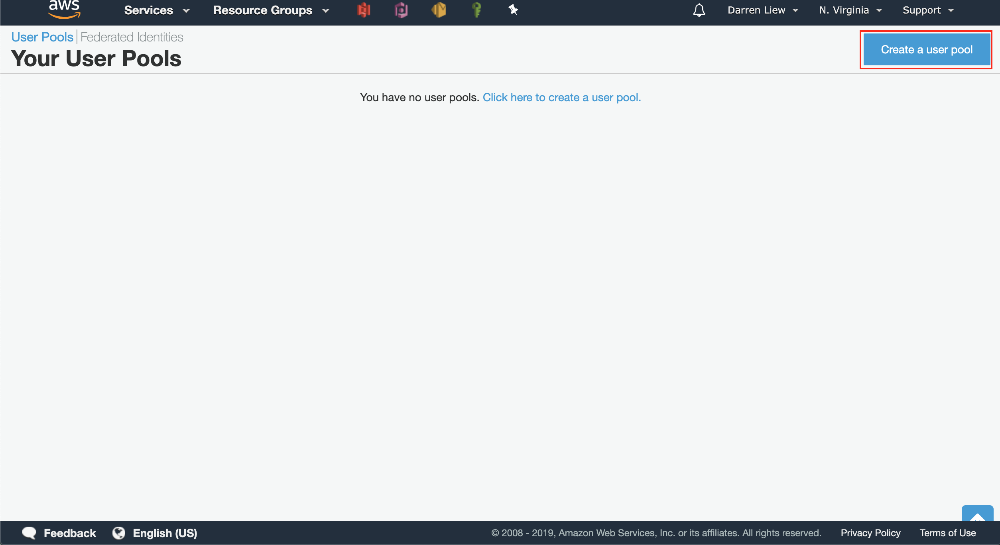
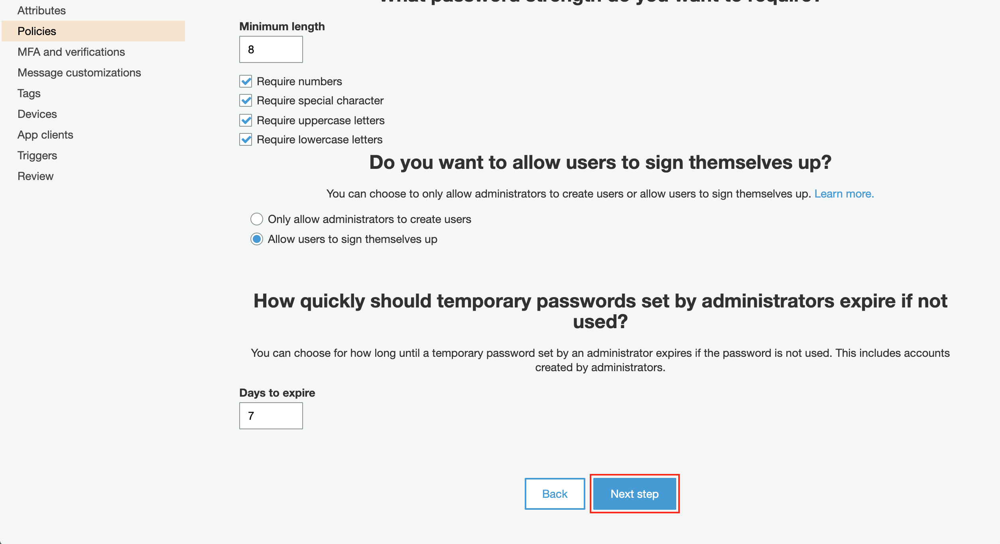
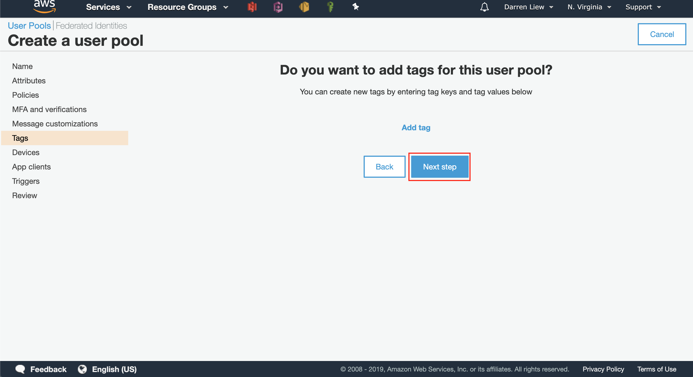
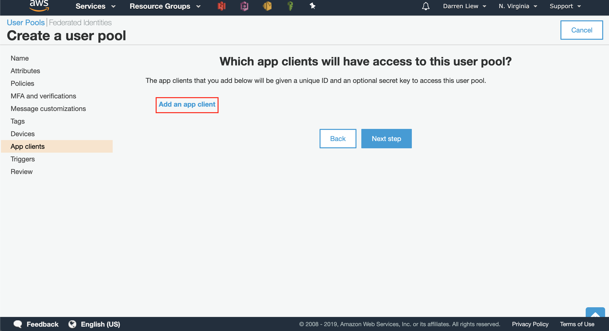
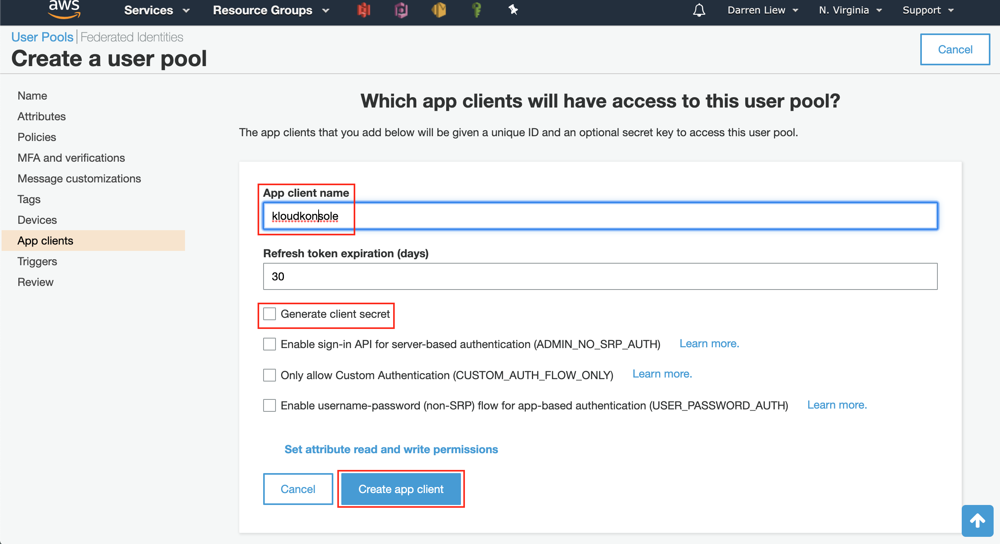
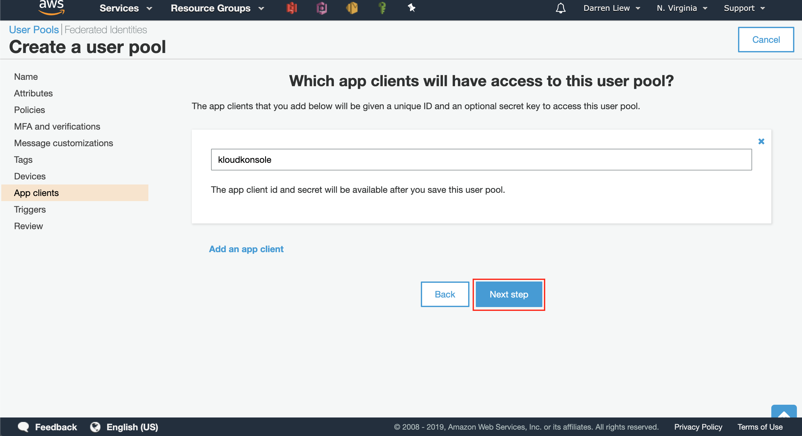
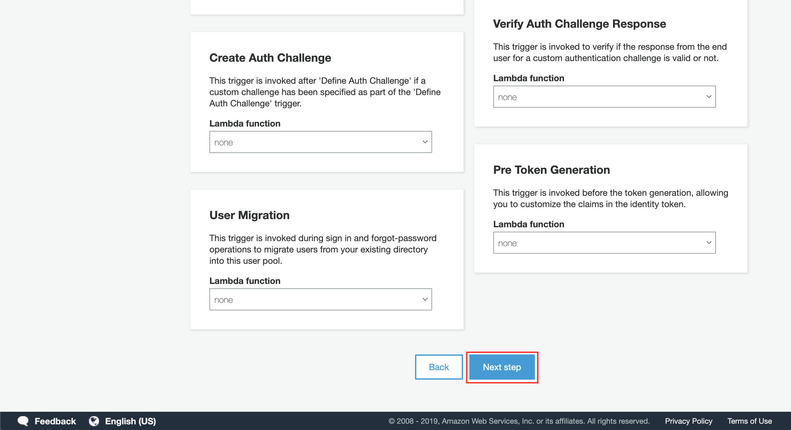

# Setup Cognito
prerequisite:
- and, about 30 mins time

## Create User Pool
* [Signin to AWS console](https://console.aws.amazon.com/?nc2=h_m_mc) if you haven't done so

* Pick `Services` > `Cognitp`

* Pick `Services` > `Cognitp`

* First click on `Manage User Pool`

* In `Verify a New Domain` dialogbox, key in you domain name, check `Generate DKIM Settings` and click `Verify This Domain`

* Your DNS settings for verification will be shown on the dialogbox, keep it open, you will it it for next step

* Go to cloudflare DNS page, make sure you selected the right domain name, key in the DNS records given in previous step
> The DKIM CNAME records can not be proxied, you need to turn the orange cloud to gray cloud

* After you successfully add these CNAME records to your domain's DNS settings, Amazon SES will automatically detect the records and allow DKIM signing at that time. Verification of those records may take up to **72 hours**.

## Create Email Receiving Rule Sets
* Select `Rule Sets` > `Create a New Rule Set`

* Give your rule set a name

* Select your newly created rule set in `Inactive Rule Sets` list and click `Set as Active Rule Set`

* Click on `View Active Rule Set` button to start editing your rule set

* Click on `Create Rule` button to start adding new mailbox

### Step 1: Recipients
* add one or more email addrescognito as recipeints then click on `Next Step`

### Step 2: Actions
* Click `Select an action type` drop down menu, and select `S3`. click on `Next Step`

* In S3 Action Section, choose `Create S3 bucket`

* In `Create S3 bucket` dialogbox, give your bucket a name

* Leave the rest of input in S3 Action section empty and click on `Next Step`

for more details setup process and explanation please check the [official docs](https://docs.aws.amazon.com/cognito/latest/DeveloperGuide/receiving-email.html)
